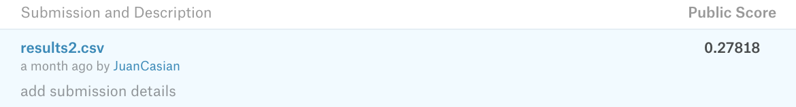

# Machine Learning House Price Prediction
This repository includes a really simple machine learning model in which the objective is to predict the price of a house depending on different variables like the location, the number of bedrooms, etc. 

### Data
The data for this project is located in Kaggle's [California House Prediction Challenge](https://www.kaggle.com/c/house-prices-advanced-regression-techniques) project.

### Specifications of the model
This model was done using the Estimators API from Tensorflow, specifically the DNN Regressor Estimator, training over 100,000 with a batch size of 100. 

### Results
After this 100,000 steps of training, this model got  0.27818 logarithmic loss score in the Kaggle competition. 

### Dependencies
- Python
- Tensorflow
- Pandas
- Numpy
- Matplotlib
- Sklearn
- Seaborn
### Author
Juan Pedro Casian - Github: [@JuanCasian](https://github.com/JuanCasian) - Email: juanpedrocasian@gmail.com
